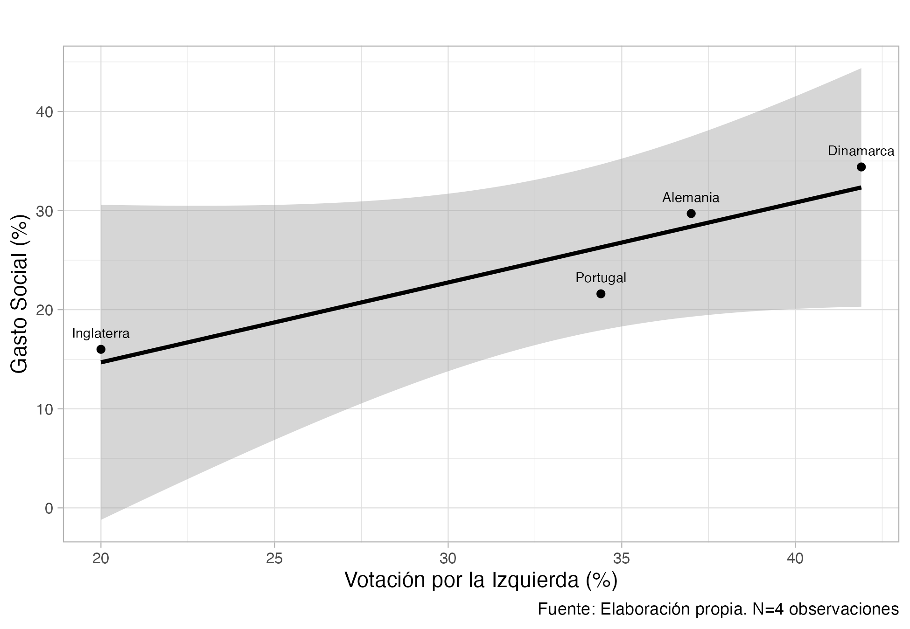

```{r setup, include=FALSE}
knitr::opts_chunk$set(echo = TRUE) # Configuraciones preliminares del documento
```

## R Markdown

La suma de 1+1 es: `r 1+1`

This is an _R Markdown_ (texto en cursiva) document. Markdown is a simple formatting syntax for authoring HTML, PDF, and MS Word documents. For more details on using R Markdown see: 

<http://rmarkdown.rstudio.com>
[Rmarkdown](<http://rmarkdown.rstudio.com>)

> When you click the **Knit** (texto en negrita) button a document will be generated that includes both content as well as the output of any embedded R code chunks within the document. You can embed an R code chunk like this:

```{r cars, echo=TRUE, eval=TRUE, message=FALSE, warning=FALSE}
summary(cars)
```

## Expresión matemática 

$\overline{x}={\frac {x_{1}+x_{2}+\cdots +x_{n}}{n}}$

$$X = \begin{bmatrix}1 & x_{1}\\
1 & x_{2}\\
1 & x_{3}
\end{bmatrix}$$

\break

Note that the `echo = FALSE` (código en texto) parameter was added to the code chunk to prevent printing of the R code that generated the plot.


## Tablas

| País          | Gasto Social  (%)| Votación por la izquierda (%)|
|:-------------:|:----------------:|:----------------------------:|
| Inglaterra    | 16.0             | 20                           | 
| Alemania      | 29.7             | 37.0                         |       
| Portugal      | 21.6             | 34.4                         |
| Dinamarca     | 34.4             | 41.9                         |

Otra manera:

```{r echo=TRUE, message=FALSE, warning=FALSE}
#Crear una tabla con valores 
tabla <- data.frame(pais=c("Inglaterra", "Alemania", "Portugal", "Dinamarca"), 
                       gto_social=c(16, 29.7, 21.6, 34.4), 
                       votacion_izq=c(20, 37, 34.4, 41.9)) 

library(kableExtra)
kable(tabla) # Generamos la tabla
```

Otra tabla de mejor calidad

```{r echo=FALSE, message=FALSE, warning=FALSE}
kable(tabla, booktabs =TRUE,                  #Estilo de la tabla
      align = c("ccc"),                       #Alineación de columnas
      linesep = "",                           #Sin línea entre columnas
      caption = "Tabla de calidad",           #Título
      col.names =c("País", "Gasto Social (%)", 
                   "Votación de izquierda (%)")) %>% #Nombre de las columnas 
  kable_styling(latex_options =c("hold_position")
                , full_width = F) %>%         #Posición de tabla
  kableExtra::footnote(general = "Elaboración propia.", footnote_as_chunk = T, 
                       general_title="Fuente:", fixed_small_size=T) #Nota al pie de la tabla
```

\break

## Including Plots

You can also embed plots, for example:

```{r pressure, echo=FALSE, message=FALSE, warning=FALSE}
plot(pressure)
```

\break

También podemos hacer gráficos más completos: 

```{r echo=TRUE, message=FALSE, warning=FALSE, fig.align='center', fig.cap="Asociación de variables", out.height="80%", out.width="80%"}
#Gráfico en ggplot
#install.packages("ggplot2")
library(ggplot2)
g1 <- ggplot(tabla, aes(y=gto_social, x=votacion_izq)) +
  geom_smooth(method = "lm", colour="black", se=T, formula=y ~ x) +
  geom_point() +
  geom_text(aes(label=pais),hjust=0.5, vjust=-1.2, size=2.5) +
  labs(y = "Gasto Social (%)", x = "Votación por la Izquierda (%)", 
       title="", caption = "Fuente: Elaboración propia. N=4 observaciones") +
  theme_light() +
  theme(axis.text.y = element_text(size=8),
        axis.text.x = element_text(size=8))
g1                                       #Ver el gráfico
ggsave("graph1.png", plot = g1) #Guardar el gráfico
```

\break

## Imagenes

+ Desde el lenguaje base de `Rmarkdown`:

```

```

+ Función `include_graphics` del paquete `knitr`:

```{r echo=TRUE, fig.align='center', fig.height=1, out.height="50%", out.width="50%"}

```

